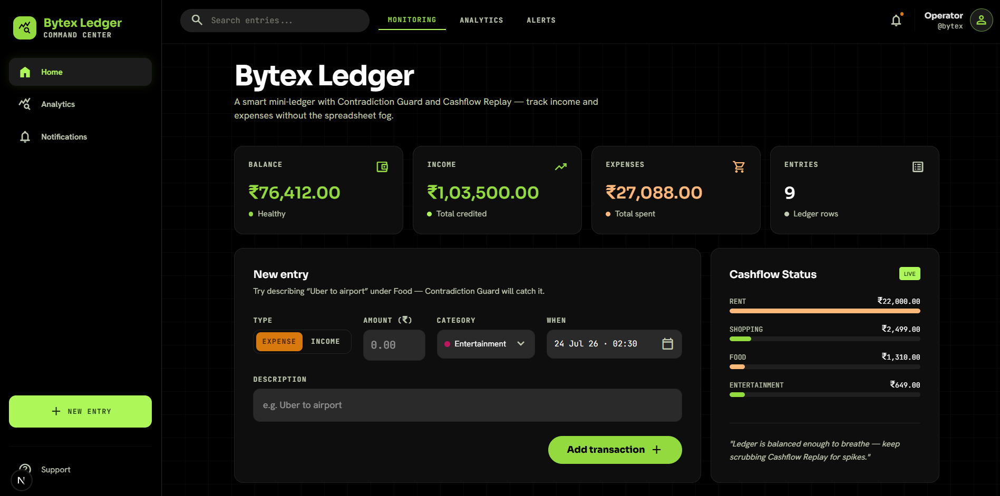

# Bytex Ledger — Smart Mini-Ledger

A lightweight full-stack financial ledger for the Bytex Challenge: add, view, and categorize income/expenses, see a live summary, get notified on notable events, and use two human-designed twists that go beyond boilerplate AI output.

**Live demo:** [https://bytex-ledger.vercel.app/](https://bytex-ledger.vercel.app/)

**UI:** dark “Command Center” shell (sidebar navigation, glass cards, Sora / Hanken Grotesk).

## Features

- **Transactions** — create, list, soft-delete; income vs expense with seeded categories; scrollable ledger table
- **Summary** — balance, income, expenses, per-category totals (bento cards + live cashflow mix)
- **Contradiction Guard** — lexicon + confidence scoring flags mismatches (e.g. “Uber” under Food) with one-click accept
- **Cashflow Replay** — SVG timeline scrubber for the current month, auto-play, category mix at the playhead, jump-to-spike
- **Notifications** — Gmail (SMTP) when configured via **Settings UI** or env; always persisted to an in-app log (large expenses + contradictions + test)
- **Optional PIN gate** — set `LEDGER_PIN` to lock the UI/API behind a cookie (no OAuth/Clerk — kept out of scope on purpose)

## Stack

- Next.js 16 (App Router) + TypeScript + Tailwind CSS v4
- Neon Postgres + Drizzle ORM
- Zod validation + Nodemailer (Gmail SMTP)
- Optional Gmail notifications + optional PIN gate

## Setup

```bash
npm install
cp .env.example .env.local
# set DATABASE_URL (Neon connection string)
npm run db:push
npm run db:seed          # categories
npm run db:seed-demo     # optional: sensible demo transactions
npm run dev
```

Open [http://localhost:3000](http://localhost:3000).

### Environment variables

| Variable | Required | Description |
|----------|----------|-------------|
| `DATABASE_URL` | Yes | Neon Postgres connection string |
| `GMAIL_USER` | No* | Gmail address used to send mail |
| `GMAIL_APP_PASSWORD` | No* | Google [App Password](https://myaccount.google.com/apppasswords) (not your normal password) |
| `NOTIFY_EMAIL_TO` | No* | Recipient inbox for ledger alerts |
| `LEDGER_PIN` | No | If set, UI/API require PIN unlock (cookie) |
| `LARGE_EXPENSE_THRESHOLD_CENTS` | No | Default `100000` (₹1,000) — triggers large-expense notify |

\*All three Gmail vars must be set together; otherwise notifications stay in-app only.

## Try the twists

1. Add an expense under **Food** with description `Uber to airport` → Contradiction Guard flag on the row → **Accept suggestion**.
2. Open **Analytics** (or scroll to Cashflow Replay) → scrub the timeline / **Auto Play** / **Jump to spike**.
3. Open **Settings** → enter Gmail + App Password → save, then **Notifications** → **Send test**.

`npm run db:seed-demo` loads a month of realistic salary / rent / food / transport entries if you want a full ledger immediately.

## Architecture

```
src/
  app/api/             Route handlers (transactions, summary, replay, notifications, auth, categories)
  components/          Command Center UI (sidebar, form, category select, ledger, replay, notifications)
  lib/
    db/                Drizzle schema + Neon client + seed / seed-demo
    contradictions.ts  Lexicon scorer
    notifications.ts   Gmail + in-app log
    money.ts           Integer paise helpers
    validations.ts     Zod schemas
  middleware.ts        Optional PIN gate for APIs
```

Money is stored as **integer minor units** (paise). Soft-deletes use `deleted_at`. `occurred_at` is timestamptz.

### Auth note

There is **no multi-user auth** (no Clerk/OAuth). Reviewers can run the app with zero login. Optional `LEDGER_PIN` is a single shared gate for demos that need a lock — intentional scope control for this challenge.

---

## AI tools used (and how they helped)

This submission was built with **Cursor** (Composer / agent) as the primary AI coding assistant.

**What AI accelerated well**

- Scaffolding Next.js App Router + Tailwind boilerplate
- First-pass Drizzle schema and CRUD route handlers
- Wiring form → API → list refresh loops
- Drafting Gmail SMTP send + env-based fallbacks
- Generating an initial SVG path for the balance curve
- First-pass Command Center layout from design HTML

Using AI for scaffolding cut the “empty folder → runnable CRUD” phase to a fraction of a manual start, so more time went into the twists, edge cases, and polish.

## Where AI fell short — and how human judgment fixed it

These are concrete failure modes that showed up (or would show up) from naive AI output, and what we did instead:

1. **Float money**  
   AI defaults to `amount: number` / `DECIMAL` with JS floats (`19.99 + 0.01` drift).  
   **Fix:** store `amount_cents` as integer; convert at the API boundary (`rupeesToCents` / `formatINR`).

2. **Hard deletes & missing audit trail**  
   Boilerplate CRUD often `DELETE FROM` permanently.  
   **Fix:** soft-delete via `deleted_at`; all reads filter `IS NULL deleted_at`.

3. **Naive category “AI matching”**  
   A typical suggestion is “use embeddings” or a brittle `includes("uber")` without confidence or type checks — noisy false positives on empty/short descriptions.  
   **Fix:** token lexicon + vote count + **threshold (50)** + income/expense type mismatch bonus; persist score/reason; one-click accept clears the flag.

4. **Email fire-and-forget**  
   AI often sends mail (or hits a webhook) and ignores failures (or crashes the request).  
   **Fix:** notification service always writes to `notifications`; Gmail is best-effort; failures are logged in-app with `status: failed` / dual row when needed. Request path still returns 201 for the transaction.

5. **Timezone-blind dates**  
   Storing `timestamp without time zone` or `YYYY-MM-DD` strings breaks month replay near UTC boundaries.  
   **Fix:** `timestamptz` + ISO strings from the client; replay buckets by UTC day key consistently.

6. **Over-abstracted architecture**  
   AI likes repositories, services, DTOs, and unused folders for a mini app.  
   **Fix:** flat `lib/` + route handlers; shared Zod schemas; no fake layers.

7. **Generic / mismatched UI**  
   AI defaults to purple gradients, Inter, native `<select>`, and unbounded tables — or pastes dashboard chrome that doesn’t match the product.  
   **Fix:** Command Center theme (Sora + Hanken Grotesk, lime/orange on black), custom category dropdown, fixed-height scrollable ledger, Material symbols used sparingly.

8. **Chart library for a scrubber**  
   AI reaches for Chart.js/Recharts for everything.  
   **Fix:** hand-rolled SVG path + range input + auto-play so the playhead and “jump to spike” feel intentional.

9. **Auth scope creep**  
   AI pushes Clerk/NextAuth for a single-ledger demo.  
   **Fix:** optional PIN cookie only; document why multi-user auth was skipped.

---

## Unique twists (beyond boilerplate)

### Contradiction Guard
Descriptions are scored against a merchant/intent lexicon. When the implied category disagrees with the selected one above the confidence threshold, the row shows a reason and suggested category. Accepting updates category (and type if needed) and clears contradiction fields, with a notification event.

### Cashflow Replay
`/api/replay` builds a contiguous daily series with running balance and per-day category mix. The UI scrubs that series; **Auto Play** advances the playhead; **Jump to spike** seeks the day with the largest absolute net swing.

---

## Screenshots / demo



**Live demo:** [https://bytex-ledger.vercel.app/](https://bytex-ledger.vercel.app/)

---

## Scripts

| Script | Purpose |
|--------|---------|
| `npm run dev` | Local dev server |
| `npm run build` | Production build |
| `npm run start` | Run production build |
| `npm run db:push` | Push Drizzle schema to Neon |
| `npm run db:seed` | Seed categories |
| `npm run db:seed-demo` | Replace active txs with sensible demo data |
| `npm run db:studio` | Drizzle Studio |

## License

Built as an application assignment for Bytex.
